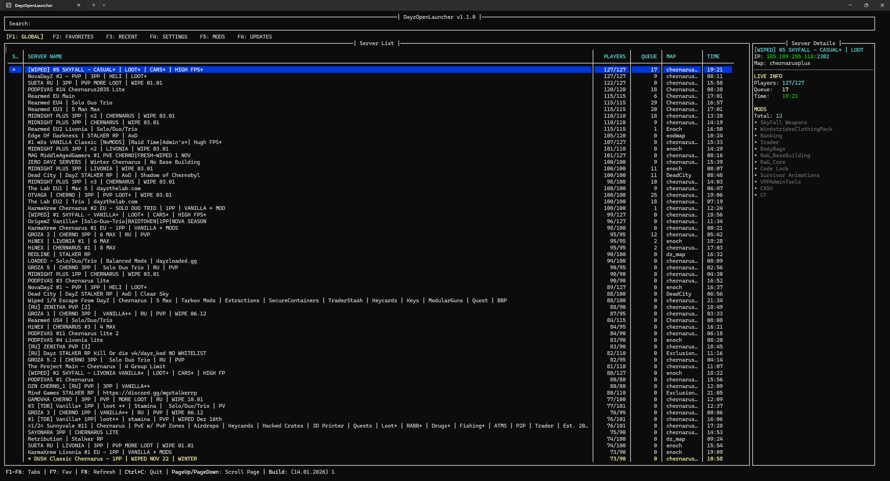

# DayzOpenLauncher

A simple Python TUI launcher for Windows PowerShell and Linux terminals that allows you to browse DayZ servers, manage favorites, settings, and mods.

## Features

- Browse DayZ servers using DZSA API.
- Manage favorite and recent servers.
- Live server info (players, queue, time, map) via A2S.
- Automated mod synchronization support.
- Mutli platform support (Windows / Linux).

## Screenshots



## Installation

### Windows
1. Go to the [Releases](https://github.com/PawelKawka/DayzOpenLauncher/releases) page.
2. Download `DayzOpenLauncher_Setup.exe`.
3. Run the installer and follow the instructions.
4. Launch the app via the Desktop shortcut or Start Menu.

### Linux
1. Go to the [Releases](https://github.com/PawelKawka/DayzOpenLauncher/releases) page.
2. Download the `dayzopenlauncher-linux` and extract it.
3. Open a terminal in the extracted folder.
4. Run the installation script:
   ```bash
   sudo chmod +x install.sh
   ./install.sh
   ```

## Windows SmartScreen Warning

- Because this project is free and open source the installer does not come with a digital certificate. Windows may display a SmartScreen message when you first run it.

## API

- Uses **DZSA API** for global server listing.
- Uses **python-a2s** for live server queries.

---

## About
- The program is multi platform (Windows/Linux).
- Everything is in development.
- The Linux launcher and install cript have been tested on Debian/Ubuntu.

